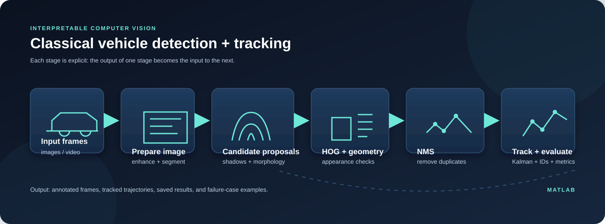
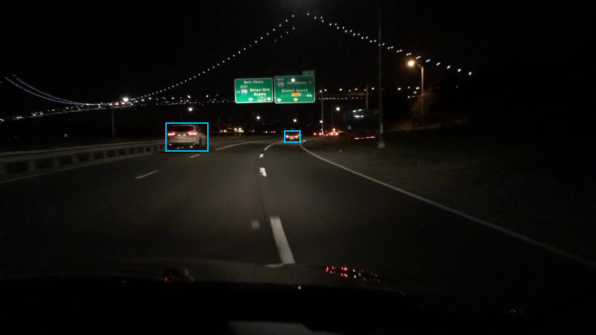
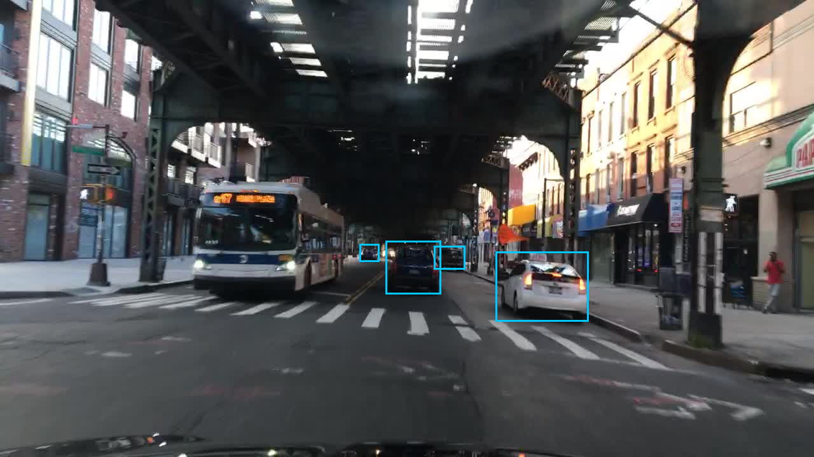

# Classical Vehicle Detection and Tracking in MATLAB

<p align="center">
  
</p>

<p align="center">
  <strong>An interpretable MATLAB baseline for vehicle detection, multi-object tracking, and failure-case analysis.</strong><br>
  Classical vision methods, explicit geometry, and motion models — no neural detector in the main pipeline.
</p>

## At a glance

| Input | Processing | Output |
| --- | --- | --- |
| Road-scene images and video sequences | Image preparation, candidate generation, HOG/appearance checks, geometry, NMS, and Kalman tracking | Annotated frames, track IDs, trajectories, saved results, and evaluation summaries |

This repository is the cleaned-up version of a classical computer-vision project. The emphasis is on making each decision visible: where candidates come from, why boxes are rejected, how tracks are assigned, and where the method starts to fail.

## Pipeline

<p align="center">
  
</p>

The main workflow combines:

- shadow and morphology-based candidate generation;
- HOG descriptors and appearance similarity checks;
- road and perspective constraints;
- IoU-based non-maximum suppression;
- Kalman filtering for position and velocity;
- appearance-aware association between detections and tracks;
- camera-motion and ego-motion compensation; and
- per-category and per-sequence evaluation.

The main script is a classical computer-vision pipeline. It does not use a neural network. `hog_car_detector.m` is a separate HOG + linear SVM experiment included as a comparison point.

## Results gallery

The checked-in images are representative outputs from the original MATLAB workflow. They cover the conditions that matter most when inspecting a detector rather than only looking at one favourable example.

<table>
  <tr>
    <td align="center"><br><sub>Normal scene</sub></td>
    <td align="center"><br><sub>Night scene</sub></td>
    <td align="center"><br><sub>Rain scene</sub></td>
  </tr>
  <tr>
    <td align="center"><br><sub>Shadow scene</sub></td>
    <td align="center"><br><sub>Occlusion scene</sub></td>
    <td align="center"><br><sub>Out-of-frame scene</sub></td>
  </tr>
</table>

### Tracking previews

The repository also contains lightweight previews of three generated tracking sequences. They are intentionally downsampled so they remain practical to open directly from GitHub.

- [Tracking sequence 0005 preview](assets/tracking_seq_0005_preview.mp4)
- [Tracking sequence 0011 preview](assets/tracking_seq_0011_preview.mp4)
- [Tracking sequence 0020 preview](assets/tracking_seq_0020_preview.mp4)

## Repository map

```text
.
├── assets/
│   ├── detection_overview.png       # Contact sheet of representative results
│   ├── pipeline.svg                 # Visual overview of the processing stages
│   ├── *.png                        # Selected detection outputs
│   └── *_preview.mp4                # Lightweight tracking previews
├── data/
│   └── README.md                    # Expected local dataset layout
├── docs/
│   └── architecture.md              # Design and evaluation notes
├── results/
│   ├── README.md
│   └── results.mat                  # Saved result structure from the experiment
├── src/
│   ├── main.m                       # End-to-end detection/tracking workflow
│   ├── compare_sobel_vs_hog_math.m  # Classical-method comparison
│   ├── hog_car_detector.m           # Optional HOG + linear-SVM baseline
│   └── test_pipeline.m              # Small smoke test
└── .gitignore
```

## Running the project

### Requirements

- MATLAB R2023b or newer is recommended.
- Image Processing Toolbox.
- Computer Vision Toolbox.
- Statistics and Machine Learning Toolbox for `hog_car_detector.m`.
- Windows MATLAB is useful for the optional memory-profiling calls.

The raw image and video data is intentionally not included. The repository is not tied to the original computer-specific paths. See [`data/README.md`](data/README.md) for the expected layout and the `KITTI_ROOT` option.

### Steps

1. Clone the repository and open it in MATLAB.
2. Put permitted image data in `data/raw_dataset_pictures/` and video sequences in `data/raw_dataset_videos/`.
3. If KITTI tracking data is available, put it under `data/kitti/` or set the `KITTI_ROOT` environment variable.
4. Run the main workflow:

```matlab
run(fullfile('src', 'main.m'))
```

Generated files are written to `results/generated/`.

The two additional experiments can be run with:

```matlab
run(fullfile('src', 'compare_sobel_vs_hog_math.m'))
run(fullfile('src', 'hog_car_detector.m'))
```

## Scope and limitations

This is an interpretable research baseline, not a production detector. Performance depends on lighting, camera geometry, segmentation quality, and the assumptions used to generate candidates. Some evaluation paths use annotated boxes for candidate verification, so the reported numbers should not be read as a blind deployment benchmark.

Only selected generated artifacts are included here. Raw datasets are not redistributed, and the repository contains no private credentials or company-internal material. For a new experiment, use data you are allowed to use and record the exact settings.

